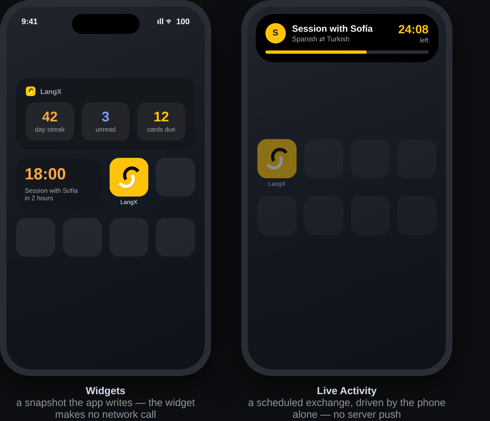
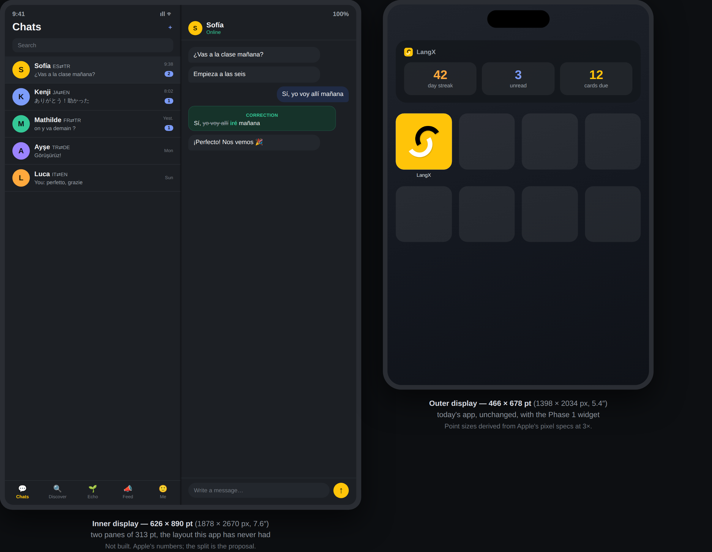
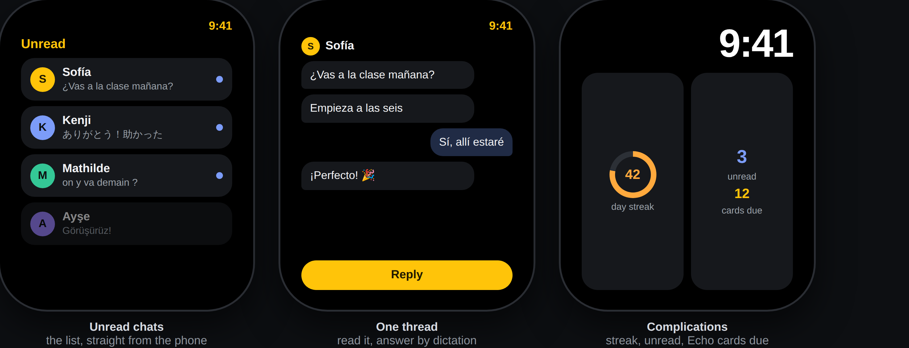
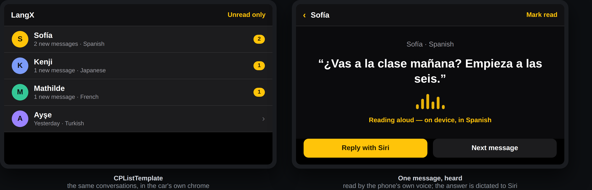

# iPhone, Apple Watch and CarPlay — plan

## Status on 18 September 2026

**Not started, and now decided.** Written as a plan on the day it was asked
for; nothing below is built, and no branch other than this document exists.
Behic answered the same day, and three of the questions at the end are
therefore answers rather than questions:

- **The CarPlay category is Communication, and the entitlement request goes
  in today.** Behic files it; nobody else can.
- **The work starts with the widgets.** Phase 0, the `react-native-carplay`
  spike, was the answer given; it needs a Mac, which is not where this is
  being written, so its desk half was done instead and the build half waits
  for one. Phase 1 leads, and it ships **all three widget families**, with
  **no Live Activity** and **no acting widget button** — the widget deep-links
  into the app and the app does the rest.
- **A bearer token may live in a shared Keychain.** So the Siri send path is
  in scope, with the REST twin and the security review it implies.

The rest of the list at the end is still open.

**The iPhone Duo arrived while this was being written.** Apple's developer
mails of 9 and 18 September announce it, with Xcode 27.1 beta and design kits;
a section below says what they do and do not tell us, and what the app already
does right. It is not a fourth surface — it is the same app on a screen that
changes size while it is running.

One of the three surfaces waits on **Apple** rather than on us. The
entitlement is requested, not switched on, and Apple publishes no turnaround
time. That is why the order of work below files the request first and builds
against it afterwards.

Read `CLAUDE.md` first. Four of its rules bite in this change and each one
bites in a place that is easy to miss from Xcode: no user-facing string is
written in a component, no handler touches a collection directly, no threshold
is hard-coded, and comments explain _why_. A Swift target cannot import
`src/i18n`, and an app extension cannot import a repository function — both
are addressed below rather than waived.

## What is being added, and what each surface is for

Three Apple surfaces the app does not have today, in one plan because they
share an architecture and share a risk, but shipping in three independent
store builds:

| Surface         | What it is                                                                                                | Needs Apple's permission? |
| --------------- | --------------------------------------------------------------------------------------------------------- | ------------------------- |
| **iPhone**      | Home/Lock Screen widgets, a Live Activity in the Dynamic Island, Siri/Shortcuts, a Control Centre control | no                        |
| **Apple Watch** | A dependent companion app, complications, and replying from a mirrored notification                       | no                        |
| **CarPlay**     | A chat list you can hear and answer without touching the phone                                            | **yes — an entitlement**  |

**The pictures below are mockups, not screenshots.** Nothing here is built, so
none of them came from a running app; they are drawn from the app's own dark
tokens (`src/lib/theme/tokens.ts`) to show what each surface would carry.
CarPlay's especially: those templates are drawn by the system, so the picture
shows the content, never pixels that are ours to choose.

None of them is a new product. Each is an existing thing — unread chats, the
streak, an Echo queue, a scheduled exchange — put where the phone is not in
the person's hand.

## What the app already is, and what that decides

Five facts about v2 decide most of the architecture here. They are not
background; each one closes off an approach that looks obvious from the
Apple side.

**Chat is socket-first.** Sending, correcting, reacting, typing and delivery
all go through Socket.io (`message:send`, `message:new`, `conversation:read`
— `apps/api/src/ws/`). REST covers reading: `/conversations/:id`, the message
window, `/me/unread`, `/conversations/:id/read`. A native Swift client that
wanted to _send_ would have to speak Socket.io, which is why nothing native
here sends directly. Two surfaces run inside the app's own JS runtime and
reuse the socket the app already holds; the one that cannot gets a REST twin
of a single mutation, described under _Siri_ below.

**Every client is cookie-based.** `auth.ts` says so in as many words —
nothing sends an `Authorization` header. A widget, a complication and an
intents extension each run in their own process with their own container, so
none of them inherits that cookie. The plan's answer is that **none of them
makes a network call**; they read a snapshot the app wrote. The one place
that cannot hold is Siri, and it is the one place a bearer token is proposed.

**Voices already exist, and they are metered.** `modules/tts/speech.ts` with
Kokoro/Piper behind it, content-addressed in storage, charged against the
`chatVoices` and `echoVoices` quotas from `PLAN_LIMITS`. Reading a message
aloud is therefore a thing the app can already do, at a cost. CarPlay does
**not** use it — see _Reading aloud costs nothing_ below.

**The runtime version is a fingerprint.** Every target added here changes the
native layer, so it changes the fingerprint, so it cannot reach an installed
build over the air. Each phase below is a store build and a review. Nothing
in this plan can be shipped as an OTA update, and any estimate that assumes
otherwise is wrong.

**`expo-audio` runs with `enableBackgroundPlayback: false`,** deliberately:
turning it on re-adds `FOREGROUND_SERVICE_MEDIA_PLAYBACK` on Android and with
it the Play declaration that version 121 sat overdue on. An iOS-only feature
must not be allowed to put that permission back into the Android manifest.
Whatever plays audio in the car is iOS-only native code, not a change to the
shared audio module.

## The rule all three obey

**A new surface is a new client, not a new door.** Everything reaching the
server from a widget, a watch, a car or Siri goes through the same repository
functions, the same access control, the same quota accounting as the app and
the socket. Where a surface needs something the API cannot answer yet, the
work is a route that calls the existing module function — never a query, and
never a "companion" collection with its own rules. If a CarPlay path could
send a message the app would have refused, the feature is wrong, not the
guard.

---

## Surface A — iPhone

Ships first because it needs nobody's permission and because it builds the
two pieces the other two surfaces reuse: the target tooling and the string
generator.

**Targets are added with `@bacons/apple-targets`.** The Swift lives in
`apps/mobile/targets/<name>/` — outside `ios/`, so `expo prebuild --clean`
does not delete it, which is the whole reason for the dependency. Hand-wiring
targets into a generated Xcode project does not survive a prebuild, and this
project has no committed `ios/` directory to hand-wire into.

**The widget reads a snapshot; it never calls the API.** The app writes a
small JSON blob into the App Group's `NSUserDefaults` and the widget renders
that and nothing else. No cookie has to be shared, no token has to leave the
Keychain, and a widget that has never been opened simply shows the empty
state. A stale snapshot is the acceptable failure here: a widget is allowed to
be a few minutes old, and is not allowed to be a second authenticated client.
That holds even though a bearer token now exists for Siri — the token buys one
extension the right to send a message, not every extension the right to poll.

The snapshot writer is a small local Expo module under `apps/mobile/modules/`
— one function, `setCompanionSnapshot(json)`. It is a no-op on Android and on
web, so call sites stay unconditional.

### The widgets, in detail

**What the snapshot holds.** Written as `companionSnapshotSchema` in
`packages/shared/src/companion.ts`, assembled by
`buildCompanionSnapshot` in `apps/mobile/src/lib/companionSnapshot.ts`:

| Field                            | Source today                              |
| -------------------------------- | ----------------------------------------- |
| `unread`                         | `GET /me/unread`, and every `message:new` |
| `streak.current`                 | `GET /me/activity`                        |
| `streak.longest`                 | `GET /profiles/me`                        |
| `streak.lastQualifiedDay`        | `GET /me/activity`                        |
| `echo.due`, `echo.nextDue`       | `GET /echo/summary`                       |
| `labels`                         | the app's own catalogues, already chosen  |
| `version`, `writtenAt`, `locale` | the app, for staleness and formatting     |

Two things changed shape once this was written rather than described.

**The day travels raw, and the freezes do not travel at all.** The earlier
draft had the widget run `streakSavable` against a banked-freeze count, which
would have been a second copy of the streak rules living in Swift — exactly
what this repo refuses everywhere else. What the widget actually needs is
smaller: `lastQualifiedDay` as a `YYYY-MM-DD` string, compared with the
device's own day key the way `deviceDayKey` already spells it. That comparison
is a string equality, not a rule, and it answers correctly after a midnight the
app slept through — which a flag computed at write time would not. Whether a
streak is still _savable_ is a question for the app and the 20:00 nudge
(`STREAK_REMINDER_LOCAL_HOUR`), not for a Home Screen tile.

**The words ride along with the numbers.** `labels` carries the three the
widget draws — `me.dayStreak`, `inbox.unread`, `echo.tileDue` — in the reader's
language, taken from the same keys the app's own tiles use, so a rewording
reaches the Home Screen without a second edit. Only the empty state, which has
no data behind it, needs a string catalogue on the Swift side.

`nextSession` is not in the first cut: the agreed meeting lives in a message
rather than in any of the four responses above, and fetching it would be the
widget's only new server work. It goes in when the Live Activity does.

**The streak is the widget's subject, and it is not the widget's to advance.**
`POST /me/check-in` exists precisely so that a background refresh, a prefetch
or a test cannot move a streak — "it advanced because something polled" is not
a rule anybody could predict. A widget that checked in on its own timeline
would be exactly that. A person _tapping_ a button is a different case — the
tap is explicit, which is what the route asks for — and it was still ruled out
on 18 September: a streak is meant to measure showing up, and a widget button
would let one run for weeks without the app ever being opened. **The widget
deep-links; it does not act.**

**Three families, and no more:**

- **`systemSmall`** — the streak, and whether today is safe. The one a person
  puts on the Home Screen and glances at.
- **`systemMedium`** — streak, unread and cards due, the three numbers the
  mockup shows; each one a deep link into its own tab.
- **`accessoryCircular` / `accessoryRectangular`** — the Lock Screen and
  StandBy pair. These are the same SwiftUI views the watch complications use,
  which is why they are built here and reused in Phase 2 rather than written
  twice.

`systemLarge` is deliberately absent: there is nothing in the snapshot that a
large widget would say that the medium one does not, and a widget that listed
conversations would need names and photos in the App Group — a copy of other
people's data sitting outside the app's own store, for no gain.

**Keeping it fresh, without a second client.** The app calls
`WidgetCenter.reloadTimelines` every time it writes a snapshot, so anything
the person does in the app shows up at once. Two things happen while the app
is closed, and each has an answer:

- **A message arrives.** The push already reaches the phone. A **notification
  service extension** — a second, tiny target sharing the App Group — bumps
  `unread` in the snapshot as the push passes through it, so the Home Screen
  is right even for somebody who never opens the app. It reads the payload it
  was handed and makes no network call of its own.
- **The day rolls over.** The timeline carries entries at the device's local
  midnight and at 20:00, so "today has not counted yet" appears on its own
  without waking anything.

Neither path spends WidgetKit's reload budget on polling, because neither is a
poll.

**Strings mostly come with the snapshot.** The app knows the person's locale
and already holds the eight catalogues, so it writes the words it has — "day
streak", "unread", "cards due" — into the blob rather than making the widget
look them up. What is left for the generated `.xcstrings` is the empty state:
a phone with no snapshot yet, where there is no app-written text to render.
That is three strings, not a catalogue.

**Signed out and first install are the same state:** no snapshot. The widget
shows the mark and one line inviting the person in. It never shows a zero,
because a zero is a claim about somebody's streak and we do not have one.
Sign-out clears the blob in the same breath it clears the session — a widget
still showing a 42-day streak after somebody signs out is a leak of their data
onto a shared phone's Home Screen.

**The Live Activity is not in Phase 1.** Decided on 18 September: the first
release is the widgets and the intents, and the Dynamic Island waits. The
reasoning for when it comes back is kept here because it is the part that took
the thinking. ActivityKit's push updates need an APNs token per activity,
which the Expo push service does not carry, and a direct APNs path is a second
delivery system for one feature. So the activity to build is one the phone can
drive by itself: **a scheduled exchange**, from the agreed time to the end of
the session (the meeting already exists — `message:meeting`, and
`expo-calendar` already writes it into the person's day). The streak deadline
is the weaker candidate for the same reason — it would want a server push at
the moment the day flips. The iPhone mockup above still shows the activity,
because that is the shape it would take when it is built.

**Siri, Shortcuts, the Action Button and the Control Centre control are one
piece of work**, because on iOS they are all App Intents. Three intents, no
more: _open the Echo review_, _open a named conversation_, and _send a
message to a named person_. The first two only route into the app and need
nothing from the server. The third is the exception to everything above and
is treated in its own section.



**Verify:** a fresh build where the widget shows the real unread count within
a minute of a message arriving, and still shows it when the app is force-quit
and a push arrives; a Lock Screen that carries the same number as the Home
Screen; "today has not counted yet" appearing by itself after local midnight;
nothing at all after sign-out; "Hey Siri, open my LangX review" landing on the
Echo tab; a `prebuild --clean` after which all of it still builds.

## The iPhone Duo

Not a fourth surface — the same app, on a device that folds. It arrives in the
middle of this plan rather than beside it, because everything above is drawn
for one screen and the Duo has two.

**What Apple has actually said**, which is two developer mails and nothing
more:

- **9 September 2026, "Get ready for iPhone Duo."** Videos, events and Q&As on
  the Developer Forums. The image is the device open: a photo filling the left
  panel, weather and map widgets beside rows of app icons on the right.
- **18 September 2026, "Start building for iPhone Duo."** **Xcode 27.1 beta**,
  Figma and Sketch **design kits** in Apple Design Resources, and workshops on
  optimising an app and building "customized experiences for all screen sizes".
  The image is the device folded, front and back, in Star White and Night Sky.

Those mails carry no measurements, and this document said for a few hours
that there were none to be had. That was wrong: **Apple has published the
documentation.** What follows is from it.

**The numbers, from `apple.com/iphone-duo/specs`:**

| Display          | Pixels      | Points at 3×  | Size | Density |
| ---------------- | ----------- | ------------- | ---- | ------- |
| Inner (unfolded) | 1878 × 2670 | **626 × 890** | 7.6″ | 430 ppi |
| Outer (folded)   | 1398 × 2034 | **466 × 678** | 5.4″ | 460 ppi |

The point sizes are the pixel counts divided by three; Apple's page gives the
pixels, and the developer write-ups quote the same points, which is what makes
3× safe to assume rather than a guess. Both displays carry the Dynamic Island,
ProMotion and Always-On.

The inner display's ratio is **1.42** — taller than it is wide, not a square
and not a landscape tablet. Split down the middle it is two columns of
**313 pt**, which is about a sidebar's width and is why a two-pane layout is
the obvious thing to reach for.

**What the developer documentation says**, from Apple's HIG page _Designing
for iPhone Duo_ and three Tech Talks (_Prepare your app_, _Design for_, _Strike
a pose with adaptive layouts_), as reported in developer write-ups — the pages
themselves render only in a browser, so these are second-hand until somebody
opens them on a Mac:

- The inner display is **regular in both width and height** size classes, with
  room for sidebars. Branch on size classes, not on idiom or orientation.
- **The inner display does not honour an app's supported interface
  orientations.** This is the line that touches us hardest, below.
- **Safe areas and layout margins are asymmetric** — each edge is handled on
  its own, especially in Split View.
- `UIScreen.main` is ambiguous on a two-display device and is said to be headed
  for deprecation; the screen comes from the window scene instead.
- New API: `onHingeChange` in SwiftUI, `UIHingeInteraction` in UIKit, for the
  fold angle. `NavigationSplitView` and `UISplitViewController` adapt on their
  own. A container called `ArrangementView` places children by size class and
  aspect ratio.
- **Xcode 27.1's Device Hub** simulates opening, closing, rotating and
  partially folding, and the write-ups say to rebuild against the **iOS 27.1
  SDK**. Four poses to support: closed portrait, closed landscape, open
  vertical, open horizontal.

**`orientation: 'portrait'` is now a claim the device ignores.**
`apps/mobile/app.config.ts` sets it, every screen in this app was drawn under
it, and on the inner display it stops being true. Nothing in the app branches
on orientation — that was checked, and there is no `ScreenOrientation` call and
no `isLandscape` anywhere — so the app will not misbehave; it will simply be
asked to lay out at 890 pt wide having never been asked before. That is the
Duo's real bill for us, and it is a layout bill, not a crash.



**What is already true here**, from reading the app rather than guessing — and
it is better news than it could have been:

- **Nothing calls `Dimensions.get`.** That is the classic folding-device bug:
  the value is read once at import and never changes, so an app that caches it
  keeps drawing for the screen it launched on. This app does not have that line
  anywhere, and `eslint.config.mjs` now refuses it. React Native's own
  `Dimensions` reads `UIScreen.main` underneath, which is the API Apple is
  moving away from — one more reason for the hook to be the only door.
- **`useWindowDimensions` is used in three files** — `MessageMenuHost`,
  `TourHost` and `chat-media`. It is the reactive hook; a fold re-renders them.
- **`layout.maxWidth` is 720** and `Screen`'s `column` applies it on every
  platform, while `fluid` caps only the web build. So an unfolded Duo would not
  stretch a chat bubble across the whole panel.
- **`supportsTablet: true`** is already set, so iOS will not letterbox us.

The expected failure is therefore not a broken app; it is **a phone-shaped app
centred in a lot of empty space**, and a person who paid for two screens seeing
one screen's worth of product.

**What the Duo changes for the widgets.** Apple's own picture of the open
device gives a whole panel to widgets and icons, which is an argument for
building them well rather than for building more of them. The medium widget is
the one that benefits. `systemLarge` stays ruled out: the reason was never a
shortage of room, it was that a large widget would need other people's names
and photos copied into the App Group, and a bigger screen does not change that.
It gets re-examined when the design kits give real sizes, not before.

**The two-pane layout is the real work, and it is not Phase 1.** The obvious
shape — the chat list on one panel, the open thread on the other — is the
layout this app has never had, on any device, because `expo-router` is driving
a stack and every route assumes it owns the screen. That is a structural change
to navigation, it would equally serve iPad, and it deserves its own plan rather
than a paragraph in this one.

**What was worth doing now, before any of this is testable:** keeping the good
state good. `eslint.config.mjs` now refuses `Dimensions.get` in
`apps/mobile/**`, with the replacement named in the message. It fixes nothing —
there was no call site — which is why it was cheap to add before the first one
arrives. Everything else waits for the design kits.

**Verify:** the app in Xcode 27.1's Device Hub through all four poses —
closed portrait, closed landscape, open vertical, open horizontal — with a chat
open: no clipped header, no lost scroll position across a fold, the keyboard
behaving in each, and both safe-area edges respected rather than mirrored. Then
the store listing's screenshot set, against whatever Apple requires for the
device.

## Surface B — Apple Watch

**The watch app is dependent, not independent.** It has no session, makes no
network call, and speaks to the phone over `WatchConnectivity`. This is the
single most important decision in this plan and it is made on the strength of
the two facts above: an independent watch app would need its own auth (a
second credential store, a second thing to revoke when an account is deleted)
and its own transport for a chat protocol that is socket-first. A dependent
app needs neither, and the cost — nothing works when the phone is out of
range — is the correct trade for a companion that exists to glance at.

**The free half is already free.** iPhone notifications mirror to a paired
watch with no code at all, and the notification actions declared through
`expo-notifications`' categories appear there too. So the first watch
deliverable is not the app: it is **checking what our existing notifications
look like on a wrist**, and adding a quick-reply action to the `messages`
category if it is missing. That lands in a normal build, with no watch target
at all.

**The app itself is three screens.** The chats that are unread, one thread
read out in plain text, and a reply sent by dictation or scribble — handed to
the phone over `WatchConnectivity`, which sends it on the socket the app
already holds. Plus the complication: streak, or unread, chosen by the person
in the watch app's own settings.

Watch strings go through the generator below. The watch's own store
screenshots and the listing update are in `docs/store` and are part of this
phase's definition of done, not an afterthought — a watch app that ships
without them is invisible.



**Verify:** a message arriving while the phone is in a pocket, answered from
the wrist, showing up in the thread on the phone; the complication updating
after a check-in; the app showing an honest "phone not reachable" state with
Bluetooth off, rather than an empty list.

## Surface C — CarPlay

**Apple decides whether this ships.** CarPlay apps must fit exactly one of
Apple's supported categories — audio, communication, EV charging, navigation,
parking, quick food ordering, driving task — and the entitlement is granted
per category, on request, case by case, with no published turnaround. Apple's
own review criteria are that the app fits _one_ category, is safe to use
while driving, and is substantively built; combining categories is explicitly
a reason to be refused.

**The category is Communication** (`com.apple.developer.carplay-communication`),
not Audio. The case for Audio is real — Echo is a review queue that could be
a playlist, and an audio app is the easier entitlement — but it is a case for
a _different app_ than the one on the store. LangX is a messaging app; a
CarPlay surface that reads out your partner's message and sends your spoken
answer is what the category is for, and it is what an entitlement reviewer
opening the app will see. We cannot ask for both, and asking for Audio in
order to ship Echo would leave chat — the thing everybody opens — outside the
car permanently. **This is a decision for Behic, and it is not reversible
cheaply**; it is the first open question below.

**The CarPlay dependency, as of 18 September 2026.** The desk half of Phase 0,
which is all that can be done without a Mac: `react-native-carplay` itself was
last published in **June 2024** and declares React ≤ 18 and React Native
^0.60; the maintained fork `@g4rb4g3/react-native-carplay` (2.7.22, December 2025) declares React 18 or 19 and React Native 0.74, 0.76 or 0.79. This
workspace is React **19.2.3** and React Native **0.86.3**, so neither one
claims our stack — the fork is one minor line short, the original is two years
behind. A peer range is not a verdict, which is why the build half of the
spike still has to run; but it means the fork is the candidate, and a native
CarPlay scene is a live fallback rather than a theoretical one.

**The car UI is driven from JavaScript.** `react-native-carplay` renders
Apple's templates from the JS side, which means the CarPlay scene runs inside
the app's existing runtime and reuses the socket, the session cookie, the API
client and the i18n catalogue with no second implementation of any of them. A
native CarPlay scene would have to rebuild all four in Swift. The cost is a
third-party dependency on the app's most fragile axis: community forks
disagree about the New Architecture, and support for Expo 57 / React Native
0.86 is **unverified**. That is exactly what Phase 0 is for, and Phase 0 has
a real no-go branch.

**Reading aloud costs nothing.** The message is read by the on-device
`AVSpeechSynthesizer` in the language `detectSpeechLanguage` already picks,
not by our voice service. Three reasons, in order: it is instant and works
with no signal, which is what a car needs; it spends no `chatVoices` quota,
so a free account can drive; and it touches no plan limit, so nothing has to
change on the website or in the GitBook docs. Our own voices stay where they
are good — Echo, and reading a phrase on purpose.

**Replying goes through Siri, and that is Apple's rule, not a choice.** A
CarPlay communication app supports SiriKit's messaging intents; dictation is
Siri's, and the app never draws its own keyboard or runs its own recorder in
the car. Which means the send path leaves the app's process, and that is the
one place this plan adds an authenticated non-app client.



### The Siri send path, and the only new auth in this plan

An Intents extension is a separate process with a separate container. It
cannot use the socket, and it does not have the session cookie. It needs two
things that do not exist today:

1. **A REST twin of `message:send`** — `POST /conversations/:id/messages`,
   calling the same function in `modules/chat/mutations.ts` that the socket
   handler calls. Not a parallel implementation: the same function, so the
   access check, the quota and the token accounting cannot diverge. A test
   asserts both paths refuse the same cases.
2. **A bearer token the extension can hold.** Better Auth's bearer plugin,
   with the token written to a shared Keychain access group at sign-in and
   cleared at sign-out and on account deletion. It is the same session with a
   second presentation, not a new grant and not a long-lived key.

Both are small. Neither is free: the second one puts a credential somewhere a
cookie was deliberately never put, and it deserves the security review that
`docs/decisions.md` gives things of that shape. **Behic has said yes to it**,
so the fallback this paragraph used to describe — a CarPlay app that reads
and cannot answer — is off the table, and the token's lifecycle is part of
Phase 3's definition of done: written at sign-in, cleared at sign-out and on
account deletion, and never outliving the session it presents.

**Verify:** the CarPlay simulator listing the same conversations as the
phone, in the same order; a message read in the right language with the
screen locked; a dictated reply landing in the thread on the phone and
counting against the same quota as one typed there; the app refusing to show
anything at all when nobody is signed in.

---

## Strings, in eight languages, from one file

`src/i18n/messages/en.ts` cannot be imported by Swift, and the rule that no
user-facing string is written in a component does not stop being true because
the component is a widget. The widgets mostly sidestep it by rendering words
the app wrote into the snapshot, but the watch, the car and every empty state
still need their own text. So: **a generator**, run in `prebuild` and in CI,
that reads the existing catalogues and writes an Apple string catalogue
(`.xcstrings`) for the native targets. One source of truth, eight locales,
and the same failure mode the app already has — a key without a translation
does not build.

A lint rule refuses a literal user-facing string in `targets/**`, the way one
already refuses the i18n import in `admin/**`.

**Verify:** adding a key to `en.ts`, running `prebuild`, and seeing it in the
widget; `pnpm -r typecheck` failing when a locale lacks it.

## Order of work

Each phase is a store build. Phases 1 and 2 are independent of Apple; phase 3
is not, which is why its paperwork starts on day one.

```
0. Spike: react-native-carplay on Expo 57 / RN 0.86, New Architecture, one
   list template fed by the real API
   → verify: conversations appear in the CarPlay simulator, or the phase
     ends in a written no-go and surface C is re-planned natively
   → in parallel, and on day one: file the CarPlay entitlement request

1. iPhone: apple-targets wiring, the string generator, the snapshot module,
   the three widget families, the notification service extension that keeps
   the count true, three App Intents. No Live Activity — it is deferred, and
   the reasoning for when it returns is kept under Surface A.
   → verify: the list under Surface A, plus a clean prebuild

1b. iPhone Duo readiness: the lint rule against `Dimensions.get` — done; then,
   once there is a Mac with Xcode 27.1 and the design kits, a fold-and-unfold
   pass over the app
   → verify: the list under The iPhone Duo

2. Apple Watch: the notification pass first, then the dependent companion
   and the complication, then the store assets
   → verify: the list under Surface B

3. CarPlay: the REST send twin and its test, the bearer path, the
   communication templates, the Siri intents
   → verify: the list under Surface C, against a real head unit as well as
     the simulator
```

## Not in this plan

Android Auto and Wear OS — a separate plan, a separate set of constraints,
and no reason to bundle them into an Apple-only piece of work. An independent
watch app. Voice or video calling, in the car or anywhere else: CallKit is a
different feature with a different entitlement conversation. iPad and Mac
layouts. Live Activities driven by the server. Echo as a CarPlay audio app —
ruled out by the category decision above, and worth revisiting only if Apple
refuses the communication entitlement.

## What Behic decided, and what is still open

Answered on 18 September 2026:

1. **CarPlay category: Communication.** Audio is not asked for, and Echo does
   not go into the car. Behic files the entitlement request the same day.
2. **A bearer token may live in a shared Keychain**, so Siri keeps its send
   intent and the REST twin is in scope.
3. **The widgets come first.** Phase 0 was the answer until it met the room it
   would be run in: the spike needs a Mac with Xcode and a CarPlay simulator,
   and the machine this plan is written on has neither. The desk half of it is
   done and is recorded under _The CarPlay dependency_ above. So Phase 1 leads,
   and Phase 0 runs the moment there is a Mac.

Still open:

1. **When does the Live Activity come back?** It is out of Phase 1, not out
   of the plan; the scheduled exchange is the one to build when it returns.
2. **Does the watch app go into the store listing now**, with its own
   screenshots, or wait until CarPlay is approved and both land together?
3. **Is the two-pane layout worth its own plan now?** It is the Duo's whole
   point and it would serve iPad too, but it rewrites how navigation works —
   and nobody can size it until the design kits are open on a Mac.
